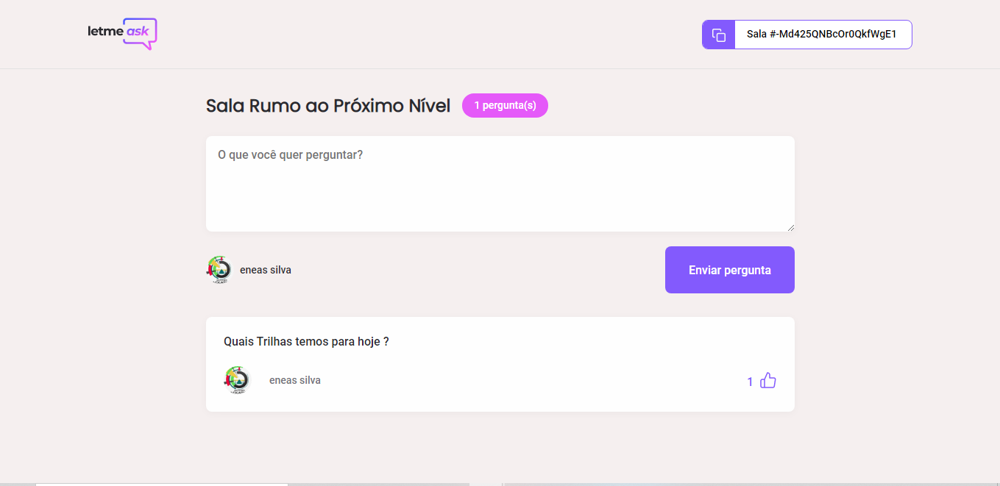
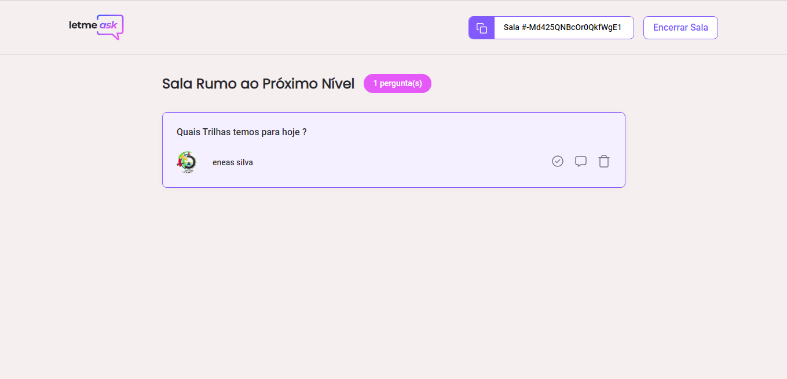
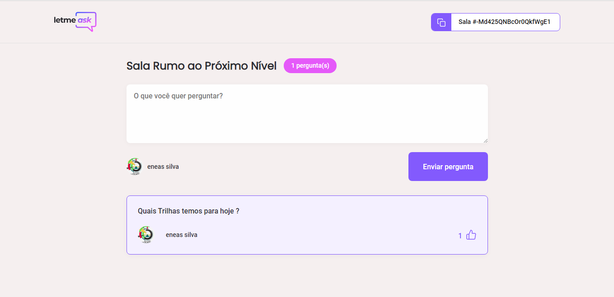

## Evento NLW da RocketSeat

## Neste evento eu tive a oportunidade de desenvolver uma aplicação seguindo uma trilha de carreira de desenvolvimento de sistema web com react js nesta trilha fizemos uma ótima aplicação que foi uma sala de chat onde varias pessoas podem ter acesso e partindo de um usuário que é o administrador que a cria sala outras pessoas podem entra e fazer quantas perguntas quiserem e fico bem legal por que eu pode ver como o react realmente funciona na pratica, eu pretendo continuar estudando o react quero usar para desenvolver novas aplicações. 

## Assuntos abordados: 
* Introdução ao React 
* Modelo de desenvolvimento web 
  * Tradicional
  * SPAs
* Relacionado ao React
  * Components
  * Propriedades
  *	Estado
  * Context
  * Hooks

## Tecnologias usadas
  * Firebase Console: <a href="https://firebase.google.com">acesse</a>
  * Sass: <a href="https://sass-lang.com/">acesse</a>
  * Typescript: <a href="https://www.typescriptlang.org/">acesse</a>
  * React: <a href="https://pt-br.reactjs.org/">acesse</a>
  * React-Router: <a href="https://pt-br.reactjs.org/community/routing.html">acesse</a>

## aqui irei mostra algumas das tela da aplicação

## a primeira é a tela inicial você pode acessar com uma conta google, ou inserir o código de uma sala já existente.

## Nesta segunda tela vemos que já entramos na sala e já possível fazer perguntas e da likes nas perguntas.

## na terceira tela vemos uma tela de admin que é o dono da sala aqui ele pode responder a perguntas marcar como respondida e também remover uma pergunta.

## Notamos nessa tela que quando o administrador da sala marca uma pergunta todos o usuários que estão na sala podem ver que a pergunta em sendo respondida ou visualizada.

